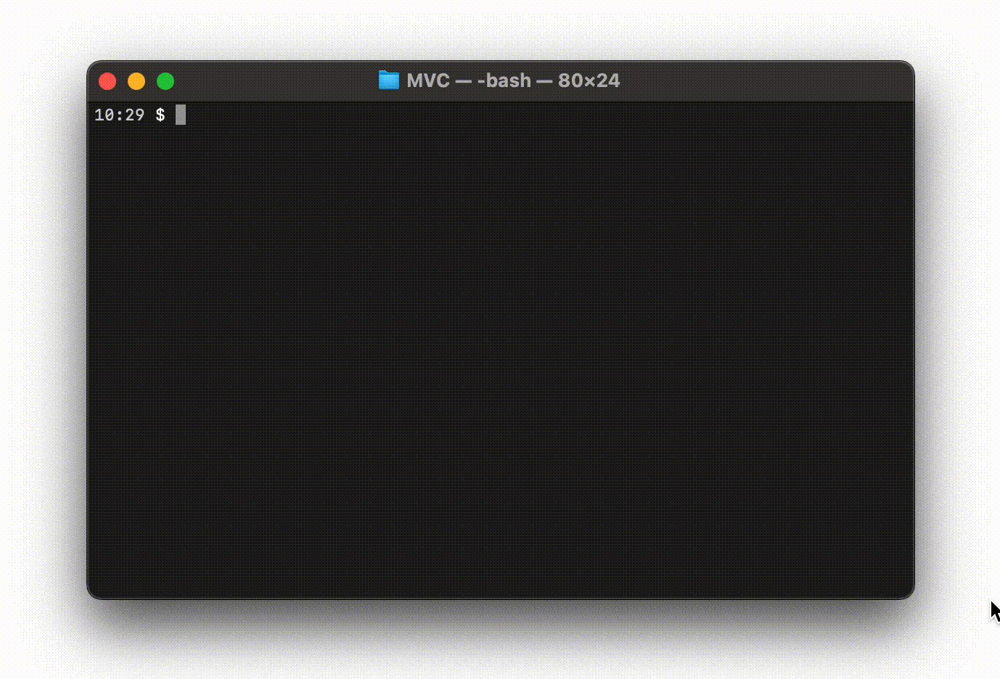

# Flashcards

## Введение
Вам предстоит создать приложение для флэш-карт, которое должно работать как показано на Рисунке 1. Сосредоточьтесь на написании элегантного, объектно-ориентированного кода, не забывая при этом о качественном проектировании и об отборе лучших методов.

*Рисунок 1*. Пример реализации флэш-карты.

### Model-View-Controller
В данной задаче есть ещё одно интересное требование. Вам необходимо следовать [шаблону проектирования][шаблон проектирования Википедия], который называется [Model-View-Controller][wikipedia mvc] (MVC) . Прежде чем начать выполнять releases, убедитесь, что вы можете ответить на следующие вопросы.

- Что представляет собой Model?
- Как используется View?
- В чем заключаются обязанности Controller?

## Releases
### Pre-release: описание и проектирование приложения
Давайте договоримся о том, как вы будете выстраивать ваше приложение. Как выглядит игра с колодой флэш-карт – от момента загрузки данных в файл до проверки того, верна ли ваша догадка? Что должно происходить? Приложение должно работать так, как было показано на Рисунке 1, но не обязательно должно быть его точной копией: например, можно дать пользователям не одну, а несколько попыток на отгадывание карточки.

Когда у вас сформируется четкое понимание того, что должно происходить, то можно приступать к разработке приложения. Нарисуйте черновой вариант объектов, которые собираетесь использовать, их взаимодействие между собой, а также общий ход программы.

Этот release занимает приблизительно 30 минут. Если вы потратили больше времени и чувствуете, что застряли, то найдите человека, который поможет вам справиться с возникшей проблемой.

### Release 0: Model-View-Controller
Отлично! Всё спроектировали! Не забыли ли вы про MVC? У вас должны быть 3 основных независимых компонента. Изменение одного из этих компонентов не должно ломать другие. 

- `Model` - отвечает за структуру хранения данных, методы работы с ними.
- `View` - отвечает только за отображение, вывод данных на экран. 
- `Controller` - умеет получать данные у Model, запрашивать View вывести их, обращаться к Model, чтобы та внесла изменения в имеющиеся данные и т.д. Важно, что всё это происходит в ответ на команды от пользователя, с которыми контроллер умеет работать.
  
В `runner.js` должно быть минимум кода! Инициализация контроллера и передача ему необходимых параметров.

При выполнении задания, следуйте как можно точнее шаблону проектирования MVC. Ваша реализация, скорее всего, будет отличаться от реализаций других команд, и это нормально.

*Примечание 1:* Здесь представлен [пример реализации MVC][пример реализации mvc] для приложения, связанного с больницей. Однако он достаточно непростой. Для начала можете поискать более базовые примеры в интернете.

*Примечание 2:* В проекте уже имеются некоторые заготовки кода, которые могут вам помочь разобраться со связями между model, view и controller. Однако для их работоспособности вам нужно решить несколько проблем. Подумайте, что произойдет с контекстом (this), когда мы передадим какой-либо метод контроллера в качестве аргумента.

### Release 1: Code

Пора кодить! У вас есть папка `topics`, в которой лежат несколько файлов с флеш-карточками (вопросами и ответами). Например, `nighthawk_flashcard_data.txt`. Пользователь должен иметь возможность воспользоваться и работать с любым из этих файлов. Также вы можете создать собственные файлы со своими вопросами.

## Заключение
Подумайте о решениях, которые вы принимали во время выполнения этой задачи. Каковы были результаты от проектирования, следования шаблону проектирования MVC?

[пример реализации mvc]: readme-assets/mvc-hospital-example.md
[шаблон проектирования Википедия]: http://en.wikipedia.org/wiki/Software_design_pattern
[wikipedia mvc]: https://ru.wikipedia.org/wiki/Model-View-Controller
